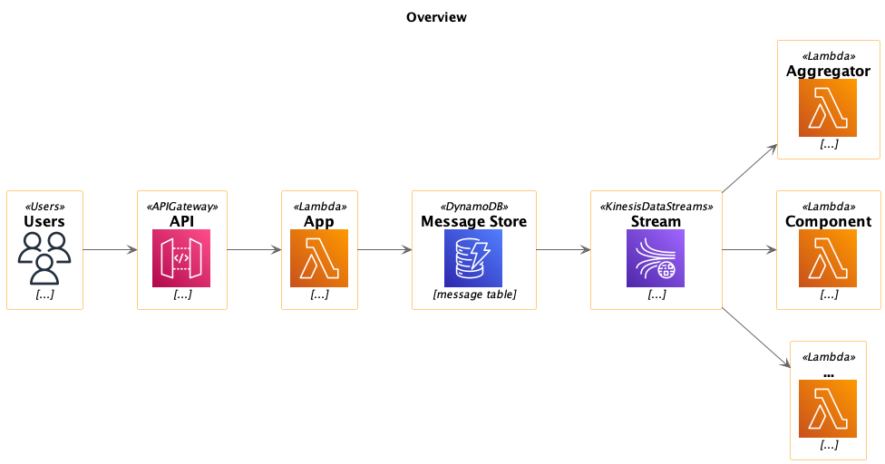

# λ in Action

> Goal: Implement an AWS Lambda application architecture on code from Garfolo's Book «Practical Microservices».



## Resources

* Practical Microservices by Ethan
  Garofolo
    * Book: <https://learning.oreilly.com/library/view/practical-microservices/9781680507782/>
    * Website: <https://pragprog.com/titles/egmicro/practical-microservices/>

## FAQ

### Knex: Timeout acquiring a connection. The pool is probably full. Are you missing a .transacting(trx) call?

Update dependency:

```
"pg": "^8.0.3"
```
