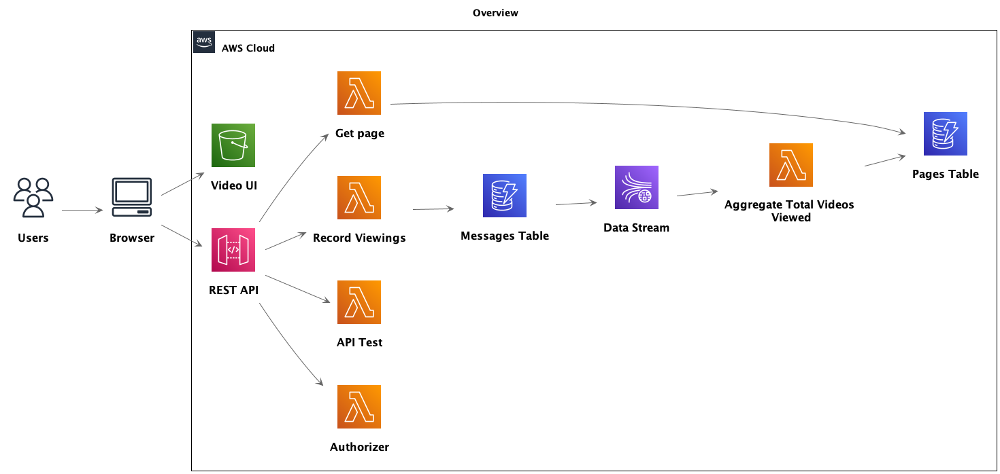

# λ in Action

> Goal: Implement an AWS Lambda application architecture on code from Garfolo's Book «Practical Microservices».



## Resources

* Practical Microservices by Ethan
  Garofolo
    * Book: <https://learning.oreilly.com/library/view/practical-microservices/9781680507782/>
    * Website: <https://pragprog.com/titles/egmicro/practical-microservices/>

## FAQ

### How can I set up my AWS profile?

Create an access key on AWS IAM, then add the following to `~/.aws/config `
```
[profile camp-lambda-in-action]
region = us-east-1
output = json
```
and the following to `~/.aws/credentials `
```
[camp-lambda-in-action]
aws_access_key_id=<id>
aws_secret_access_key=<secret>
````
(replacing the placeholders with the actual access key values, of course).

### I get the following error. What should I do? Knex: Timeout acquiring a connection. The pool is probably full. Are you missing a .transacting(trx) call?

Update dependency:

```
"pg": "^8.0.3"
```
